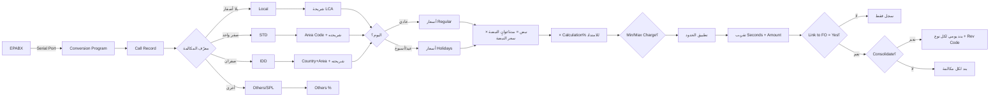

# 04 — تدفقات العمل (Workflows) — وحدة TEL

> **WF-TE-01..14** — من نبضة EPABX حتى قيد الفوليو، ومن تسجيل الوصول حتى تعطيل الكرت. الوحدة **محرّك استقبال** أكثر منها شاشات إدخال: أغلب التدفقات تبدأ من العتاد أو من FO.

---

## WF-TE-01: دورة حياة المكالمة (الاستقبال → التسعير → الترحيل) ⭐

- **الزمن المرجعي:** "The actual call charge is calculated when the called number responds" (Matured) — عدّ من الرد (Battery Reverse Signal).
- **البوابات قبل التسعير:** حالة الامتداد (Activate) + بوابات الأنواع (Local/STD/IDD Yes/No) — مكالمة من نوع ممنوع لا تسجل أصلاً (أو تُسجل خطأ — غير مصرح).

## WF-TE-02: دورة الخطأ → الفحص → إعادة الترحيل ⭐

1. **التقاط:** "All the call details are captured from data transfer that happens between EPABX and the Serial Port" (CAC ص4).
2. **فحص 4 شروط:**
   - Extension not defined (امتداد غير معرف)
   - **Room vacant** — "group check-in. The keys were given... guest checked-in... but the same check-in is not recorded in the PMS" (السباق الشهير!)
   - Call Duration ≤ Uncharged Duration
   - Bad records — "01/@2/99 instead of 01/02/99" (محرف غير معرف)
3. **عرض:** View-Update Telephone Error — تواريخ تلقائية (Accounting + System) + فلتر Error Type + Enter → القائمة.
4. **إعادة الترحيل:** "Under the Select column double-click... to change the status to YES (**YES means the calls will be reposted to the Guest/Room folio for billing**)" → Save.
5. **التحقق اللاحق:** Unbilled Call List (REP) + View Unbilled Calls (LUK) — قناتا المراجعة.

## WF-TE-03: فوترة الهاتف للنزيل (Print Telephone Bill)

- مدخل: For the Date (≤ Accounting Date) → All/Specific Rooms (F1) → Include Taxes → **Round Sec (60)** → Room# wise / **Registration# wise** → معاينة → طباعة.
- المخرجات: "Called number, Place, Time, Duration, call amount, tax amount, net amount" لكل مكالمة.
- قناة الاسترداد المكمل: View Unbilled Calls — "get the list of bills that have to be billed and added to the respective Guest folio".

## WF-TE-04: دورة كرت الباب (الإقامة الكاملة) ⭐

| المرحلة | النمط | الحدث |
|---|---|---|
| تسجيل الوصول | **New Check-In** | "encode the guest stay details on the key card... to enable opening the door **only during the guest stay period**" (Room#1/2 + Nights + From/To + CI/CO Time) |
| مرافقون/عائلة | **Copy Card** | "same features" للعائلة/المجموعة بطلب صاحب الكرت الأساسي |
| طلب نزيل غائب | **Single Open Card** | ممثل الفندق يفتح **مرة واحدة فقط** (Onity) |
| استفسار | **Read a Card** | عرض CI/CO Date/Time المخزنة (Onity) |
| المغادرة | **Check Out** | تعطيل الكرت (القارئ موصول + الكرت في الفتحة) |

- **قناة النقل:** "Encode → saved in the **backend**, read by the **door lock interface program** and send to the **device**" — فصل بين الواجهة والعتاد.

## WF-TE-05: دورة كلمة مرور الامتداد

1. "when a **Guest registration is done**" — إنشاء عند التسجيل (Room: غرف مشغولة فقط + Reg#؛ Extension: Location تلقائي).
2. صلاحية الاستخدام طوال الإقامة.
3. "valid till the **Guest checkouts**" — انتهاء تلقائي بالمغادرة.
4. (لا تغيير/استعادة موثقة — GAP-TE-P05.)

## WF-TE-06: تحويل مكالمة (Call Transfer)

1. From Extension = **قسم حصراً** (قاعدة المصفوفة).
2. To Extension = قسم/غرفة/متجر.
3. List → "Under the Select column double-click... YES means the call is transferred" → Save.
4. التتبع: Transferred Call List (REP ص10-11) بفلاتر Extn to Extn / Extn to Room / All.

## WF-TE-07: تفعيل/إيقاف امتداد مع بوابات الأنواع

- Room أو Extension → Function (Activate/De-activate) → Local/STD/IDD لكلٍّ Yes/No → Save.
- **سيناريو موثق:** خط مفعّل + Local=NO → "you cannot make any local calls from this line".

## WF-TE-08: دورة الرسائل للنزيل (Guest Page Messages) ⭐

1. Guest Information → زر Messages → "View All Messages".
2. "After the message has been conveyed to the Guest, the user can **double-click the option under Tag column to change it to YES**".
3. "which indicates that the message has been conveyed... this entry is no more required" → الحفظ يخفيها: "the entry **will not show in the Guest Page Messages again**".
4. نفس النمط لـ**Guest Location** (وُجد النزيل؟ Tag=YES → إخفاء).

## WF-TE-09: التسعير بأغلى شريحة (المسار الدفاعي)

- مكالمة لوجهة غير معرفة → الشراكات: Country 9999999999 + Area 9999999999 → "highest IDD slab" / بلد فارغ + Area 9999999999 → "highest STD slab".
- النتيجة: فوترة كاملة رغم نقص البيانات — حماية إيراد مدمجة في الماستر.

## WF-TE-10: إصدار شريحة زمنية جديدة (التعديل المستحيل)

1. لا يمكن Modify/Delete — "Add a **new record with the same slab code** but with a **new applicable from date**".
2. Applicable From > تاريخ اليوم (لتفعيل مستقبلي) — ولا يجوز نسخ من شريحة أُنشئت **نفس اليوم**.
3. المحرك "will consider the call rates from the record that has the **latest applicable from date**".
- **مثال الدليل:** شريحة "1": 18-Dec-2011 + 1-Jul-2012 → التسعير بـ2012.

## WF-TE-11: توليد الأعياد بأيام الأسبوع

- Holiday Table → Auto Generation → اختيار يوم (Sun-Sat) → From/To → **Generate** → كل تواريخ اليوم في المدى → إدراج في الجدول → حفظ.
- الغرض المزدوج الموثق: "holiday **or** a day where **discounted call charges** are applied" — تعرفة أسبوعية مخفضة.

## WF-TE-12: دفتر Yellow Pages (إنشاء/طباعة)

- Create Address Book → فئة رئيسية (إلزامي) + فرعية → الاسم/العنوانين/الاتصالات → Save.
- استعراض شامل: Panel → Yellow Pages.
- الطباعة: Print Yellow Pages → Main Category → مطابقات → طباعة ("Doctors, Hospitals, Theaters, Air/Rail-Ticket Bookings, Hotels, Resorts, Transport").

## WF-TE-13: استعلام عامل السنترال (Guest Information Console)

- Name/Room# (F1 → Room Help → نقر مزدوج) → التفاصيل.
- أزرار فرعية: Instructions (تعليمات الغرفة) · Complaints (شكاوى) · Messages (WF-TE-08) · Guest Location.
- **الزر الإداري:** "for administrative purposes **only** and used only by the **System Administrator** to resolve **SL# mismatch issues**".

## WF-TE-14: الاستعلام عن الرقم/الوجهة (Dial Code Search)

- مساران: بالرقم (Dial # → Enter) أو باسم المكان (Place Name → Enter).
- الناتج: "Country's code and name, Area code and Area name and the minimum and maximum call charges and the rate slabs".

## خريطة التدفقات ↔ الوحدات

| التدفق | يعتمد على | يغذّي |
|---|---|---|
| WF-01/02/03 | EPABX + Extension/Slabs/Codes + Holiday | FO Folio + Revenue Codes |
| WF-04 | FO Registration/Room | Door Lock Device |
| WF-05 | FO Registration/Checkout | EPABX (كلمة المرور) |
| WF-06 | Extension Master | Call Record |
| WF-08 | FO Messages | Guest Page Messages |
| WF-13 | FO Guest/Instructions/Complaints | المشغّل |
