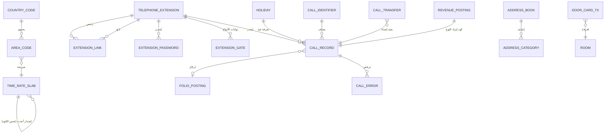

# 14 — نموذج البيانات (Data Model) — وحدة TEL

> **16 كياناً / ~120 حقلاً** — قلبها **Call Record** (المستلم من EPABX) المرتبط بالامتداد؛ حوله ماسترات تسعير هرمية (Identifier → Country → Area → Slab × Holiday) + كيانات دورة الإقامة (Password/Card) + Address Book. السمة البارزة: **حتمية زمنية** في Slabs (لا تعديل — أحدث يفوز).

---

## 1. مخطط الكيانات (ER)

## 2. جداول الكيانات

### 2.1 TELEPHONE_EXTENSION (ماستر الامتدادات)
| الحقل | النوع | القيود |
|---|---|---|
| extension_no | numeric(6) | مفتاح |
| ext_class | enum | Room / Department / Shop/Public |
| property | FK → SYS.Property | — |
| info_ref | numeric | Room# / Dept code / Shop# (حسب ext_class) |
| calc_local / calc_std / calc_idd / calc_other | numeric(3) | نسب الحساب ×4 |
| name | varchar(30) | اختياري |
| device_type | enum | Phone / Fax |
| equipment_code | varchar | اختياري |
| location_details | varchar | اختياري |
| status | enum | Active / Passive |

### 2.2 EXTENSION_LINK (روابط التوائم)
| main_extension (FK) | linked_extension (FK) | — |
|---|---|---|
| العلاقة N:M بإسناد رئيس واحد — "must be linked... to avoid errors during billing" |

### 2.3 COUNTRY_CODE / AREA_CODE
| كيان | حقول | شراكات إلزامية |
|---|---|---|
| COUNTRY_CODE | code(10) · name(30) · status | **LCA** + **9999999999** |
| AREA_CODE | country(FK) · area_code(10) · name(30) · slab(FK) · min_charge · max_charge | **LCA/LCA** + **9999999999/9999999999 (أعلى IDD)** + **NULL/9999999999 (أعلى STD)** |

### 2.4 TIME_RATE_SLAB (الشرائح — خالدة) ⭐
| الحقل | الدلالة |
|---|---|
| slab_code + applicable_from | مفتاح مركب! — نفس الكود بتواريخ متعددة |
| name(30) / currency(FK) | — |
| from_time (00.00 تلقائي) / to_time | نافذة زمنية |
| pt_seconds_regular / pt_rate_regular | نبضة/سعر المزوّد (عادي) |
| hotel_seconds_regular / hotel_rate_regular | نبضة/سعر الفندق (عادي) |
| pt_seconds_holiday / pt_rate_holiday | المزوّد (عيد) |
| hotel_seconds_holiday / hotel_rate_holiday | الفندق (عيد) |
- **قاعدة الخلود:** لا UPDATE/DELETE — INSERT بنفس الكود + تاريخ أحدث؛ القراءة: "latest applicable from date".

### 2.5 HOLIDAY
| date (> accounting date) | day (تلقائي) | occasion |
|---|---|---|
| + قناة التوليد: weekday + range → مجموعة تواريخ |

### 2.6 CALL_IDENTIFIER
| code (بادئة الرقم المطلوب) | call_type (Local/STD/IDD/Others) |
|---|---|
| مثال محفوظ: "0"→STD · "00"→IDD · ε→Local |

### 2.7 CALL_RECORD (قلب الوحدة) ⭐
| الحقل | الدلالة |
|---|---|
| call_datetime | من EPABX |
| extension (FK) / room (منعكس من ext) | — |
| called_number / place | — |
| call_type | Local/STD/IDD/SPL/Others |
| duration_seconds | Matured (من الرد!) |
| pulses | duration ÷ slab.seconds |
| pt_charge | تكلفة المزوّد (منظور!) |
| guest_charge | after calc% + min/max + rounding |
| tax_amount / net_amount | Government Tax Structure |
| posted_flag / posting_mode | فردي/موحد |
| revenue_code (FK) | لكل نوع |
| error_type | extension_undefined / room_vacant / duration_low / bad_record |

### 2.8 FOLIO_POSTING (الترحيل — عبر FO)
| entry | لكل مكالمة (Consolidate=No) أو يومي+نوع (Yes) |
|---|---|
| folio(FK→FO) · revenue_code · amount · tax · round_amount |

### 2.9 CALL_ERROR / CALL_TRANSFER
| كيان | حقول |
|---|---|
| CALL_ERROR | call(FK) · error_type · select_flag (YES = repost) |
| CALL_TRANSFER | from_ext (**قسم!**) · to_ext · calls[] · date |

### 2.10 EXTENSION_PASSWORD
| room/ext (FK) | password (numeric ≤10) | reg# (FK→FO) | valid_until (checkout) |
|---|---|---|---|

### 2.11 EXTENSION_GATE (بوابات الأنواع)
| extension (FK) | line_status (Activate/De-activate) | local_allowed / std_allowed / idd_allowed (Y/N) |
|---|---|---|

### 2.12 DOOR_CARD_TX
| mode (new/copy/single_open/disable/read) | room1 · room2 · nights · from/to_date · ci_time · co_time | encoded_at (backend) |
|---|---|---|

### 2.13 ADDRESS_BOOK + ADDRESS_CATEGORY
| main_category(15) ⟵ parent | sub_category(15) | entry: prefix(10)+name(45)+residence[9]+office[9]+remarks(200) |
|---|---|---|

### 2.14 TELEPHONE_LINK_SETUP (Singleton)
| epabx_prefix(1) | conversion_program(7) | uncharged_duration | link_to_fo(Y/N) | two_way(Y/N) | round_seconds | round_required(H/N/L/None) | round_amount | govt_tax_structure |
|---|---|---|---|---|---|---|---|---|

### 2.15 REVENUE_POSTING
| call_type | consolidate(Y/N) | revenue_code(FK) |
|---|---|---|

### 2.16 GUEST_MESSAGE_TAG (حالة رسائل FO من TEL)
| message(FK→FO) | tag conveyed (Y/N) | location_found (Y/N) |

## 3. حالات التفرد والمفاتيح

| الكيان | المفتاح | ملاحظة |
|---|---|---|
| TELEPHONE_EXTENSION | extension_no | تفرّد مفترض (غير موثق!) |
| TIME_RATE_SLAB | (slab_code, applicable_from) | **مفتاح مركب** — لا تكرار التاريخ لنفس الكود |
| AREA_CODE | (country, area_code) | الشراكة C تسمح ببلد NULL! |
| CALL_RECORD | (لا مفتاح موثق) | مرشح: (datetime, extension, called_number) |
| EXTENSION_PASSWORD | (room أو extension) | فردي حسب النمط |

## 4. الأحجام التقديرية (فندق 200 غرفة)

| الكيان | الحجم اليومي/الكلي |
|---|---|
| CALL_RECORD | ~300-1000/يوم (أعلى جدول تشغيلي في الفندق) |
| HOLIDAY | ~15-40/سنة + أيام أسبوع مخفضة |
| AREA/COUNTRY | ~مئات |
| TIME_RATE_SLAB | عشرات × إصدارات |
| DOOR_CARD_TX | بمعدل CI/CO |
| ADDRESS_BOOK | عشرات-مئات (شخصي) |

## 5. مؤشرات الاستعلام الضمنية

- CALL_RECORD(extension) — Room Calls Query + Extension Wise.
- CALL_RECORD(date[, type]) — كل التقارير.
- CALL_RECORD(error_type, posted_flag=N) — Unbilled.
- AREA(country) — Master List نمط 2.
- SLAB(latest by applicable_from) — التسعير.
- HOLIDAY(date) — تصنيف اليوم.
- CALL_IDENTIFIER(prefix match) — تصنيف المكالمة.
